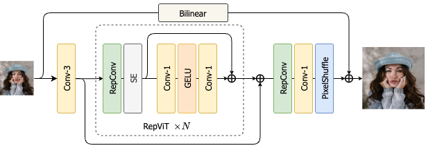
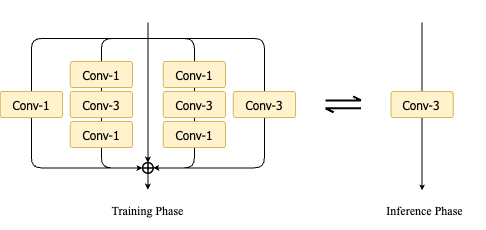

# RVSR: Towards Real-Time Super-Resolution with Re-parameterization and ViT architecture

> Zhiyuan Li, Hao Wei, Chenyang Ge<br>
> 
> We propose a real-time image super-resolution method called RVSR, which is inspired by previous work [RepViT](https://github.com/THU-MIG/RepViT) and [FMEN](https://github.com/nju-jet/fmen). Our method leverages the efficient architectural designs of lightweight ViTs and the re-parameterization technique to achieve superior performance in real-time super-resolution tasks. RVSR first applies a 3×3 convolution to convert the channel of feature map to the target size (16). Then, RVSR employs 8 stacked RepViT blocks to perform deep feature extraction. As shown in Fig. (a), the RepViT blocks integrate the efficient architectural designs of lightweight ViTs. Additionally, RVSR employs the RepConv module to improve the SR performance while maintaining low complexity, as shown in Fig. (b).

<p align="center">
    <br>
    (a) Detailed architecture of RVSR
</p>

<p align="center">
    <br>
    (b) The RepConv module
</p>

## :wrench: Installation
```bash
pip install -r requirements.txt
```

## :zap: Inference
- Modify the configuration file `configs/conf.yaml` accordingly.
```bash
pretrained_path: "pretrained/RVSR_rep.pth"
network:
  target: models.inference_arch.RVSR
data:
  val:
    lr_path: ["Path to your low resolution images"]
    hr_path: ["Path to your high resolution images"]
```
- Inference on your own datasets.
```bash
python3 test.py
```
## :computer: Training
We provide the training codes for RVSR.
- Modify the configuration file `configs/conf.yaml` accordingly.
```bash
network:
  target: models.train_arch.RVSR
data:
  train:
    lr_path: ["Path to your low resolution images"]
    hr_path: ["Path to your high resolution images"]
  val:
    lr_path: ["Path to your low resolution images"]
    hr_path: ["Path to your high resolution images"]
```
- Training on your own datasets.
```bash
python3 train.py
```

## :book: Reparameterize
After training, you can utilize re-parameterization techniques to streamline complexity without compromising SR performance.

```bash
python3 reparameterize.py --pretrained_path path_to_your_model
```

## :memo:TODE
- [x] Release code and pretrained models

## :heart: Acknowledgement
This work is based on [RepViT](https://github.com/THU-MIG/RepViT), [FMEN](https://github.com/nju-jet/fmen) and [Bicubic++](https://github.com/aselsan-research-imaging-team/bicubic-plusplus), thanks to their invaluable contributions.